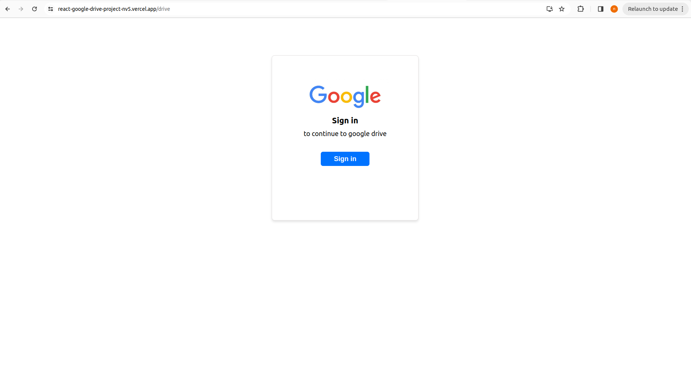
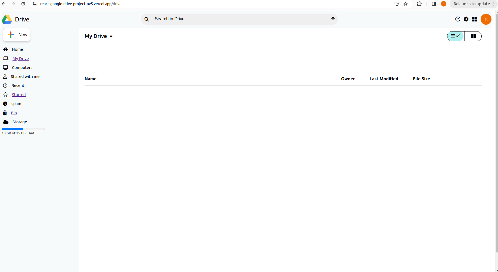
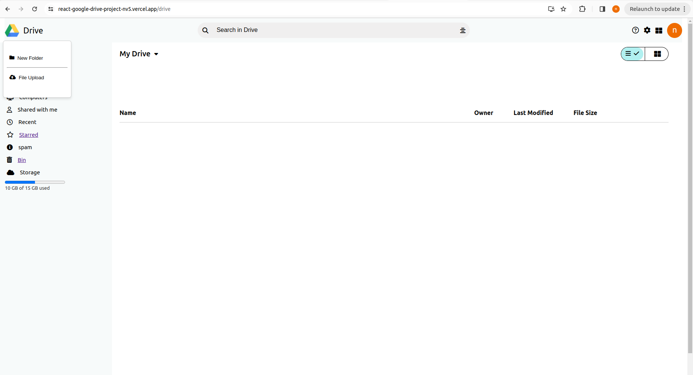
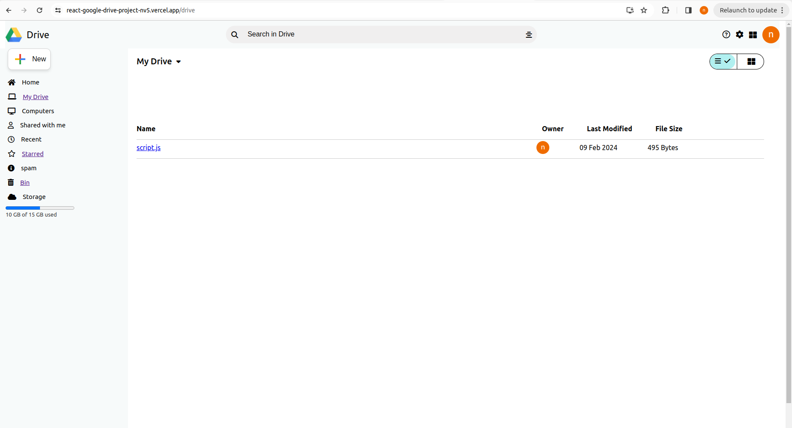
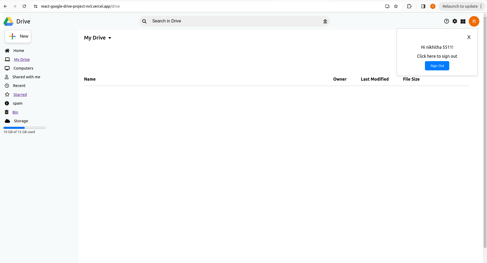

# Google Drive Clone Project
### Overview
* This project aims to create a web application similar to Google Drive where users can upload, store, manage, and share files and folders securely.

## Features
* User Authentication: Users can sign up, log in, and log out securely using email/password authentication.
* File Management: Users can upload files, create folders.
* Starred Files: Users can mark files as starred for quick access to important files.
File Preview: Users can preview supported file types (e.g., images, documents) directly in the application.
* Bin: users can able to add files to bin.

## Technologies Used
* Frontend: React.js, HTML5, CSS3, JavaScript
* Backend: Firebase Authentication, Firebase Firestore (or Firebase Realtime Database)
* Storage: Firebase Storage for file storage
* Deployment: vercel

### Setup Instructions
* Clone the repository from GitHub: git clone <repository_url>
* Install dependencies for both frontend and * backend: npm install
* Configure Firebase project:
* Set up Firebase Authentication with email/password provider.
* Set up Firebase Firestore or Realtime Database for storing user data and file metadata.
* Set up Firebase Storage for storing files.
Update Firebase configuration in the frontend code (src/Firebase/Firebase.js).
Run the frontend: npm start

### here are some screenshots of the project

